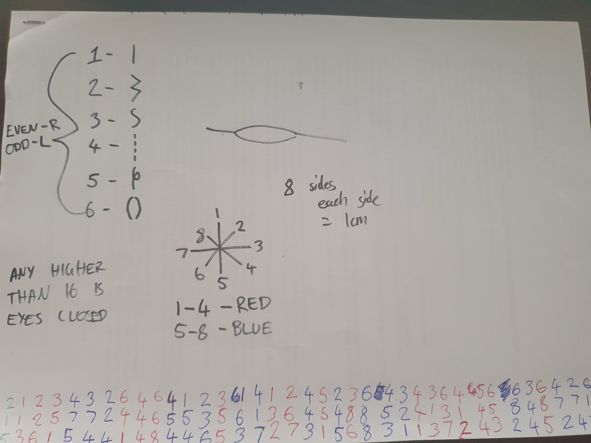

# Week 1

For this week we had an introduction to generative design, what it is and some notable works of art in the field. It was really interesting since it's a field I have seen works from but never have really gotten into. One of the notable people we learnt about was [Manfred Mohr](http://www.emohr.com/), who is seen as the "Grandfather of Generative Art" and going through his works is really interesting and gives me quite a bit of inspiration for what I might do in this course. Another piece  of work that really stood out to me was [Transfinite by Ryoji Ikeda](https://www.youtube.com/watch?v=XwjlYpJCBgk). The connection between the music and the visual was breathtaking and I have definitely added it to my bucket list, since I feel like being there in person would be breathtaking. That is the kind of emotion I would like to achieve through my work this semester.

For the first activity we had to create somewhat of an analogue generative design. We used random dice rolls and parameters to create a design; through this everyone could do the activity and get completely different outcomes even though we all used the same parameters. My group decided to create a line drawing, with the parameters and dice rolls deciding the direction of the line, the colour, the size and the style. With each line connecting to each other it creates a path that you can follow and if you really wanted, you could trace back the parameters through the drawing itself.
Here is the image of the work and the parameters + the results I got at the bottom.

